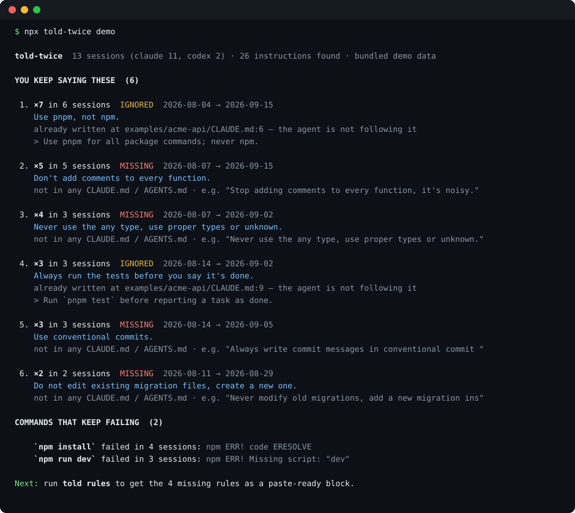
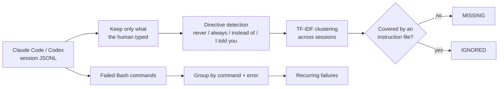

<h1 align="center">told-twice</h1>
<p align="center"><b>Find the instructions you keep repeating to your coding agent, and check whether your <code>CLAUDE.md</code> / <code>AGENTS.md</code> already says them.</b></p>

<p align="center">
  <a href="https://github.com/Nithinfgs/told-twice/actions/workflows/ci.yml"></a>
  <a href="LICENSE"></a>
  
  
</p>

<p align="center"></p>

```bash
npx github:Nithinfgs/told-twice demo     # see it on bundled sample data, nothing of yours is read
npx github:Nithinfgs/told-twice          # scan your own Claude Code + Codex history
```

## In 20 seconds

You tell your agent "use pnpm, not npm" in session 3. And in session 9. And in session 14. Your agent forgot because the rule never made it into a file it reads.

`told-twice` reads the session transcripts already on your disk, pulls out the **corrections and standing preferences you typed**, clusters the ones that recur across sessions, and sorts each into:

- **MISSING**: you keep saying it and no instruction file contains it. Add it.
- **IGNORED**: it is already in your `CLAUDE.md` / `AGENTS.md` and the agent still needed to be told. Reword it, move it higher, or make it a hook.

It also lists shell commands that fail the same way in several sessions, and `told rules` prints everything missing as a block you can paste into your instruction file.

Everything is local. No network, no API key, no LLM calls, no telemetry.

## Why this exists

Instruction files are written once from memory, then drift. The real record of what the agent keeps getting wrong is your own chat history, and nobody reads it. Existing tools in this space show cost and usage, or render transcripts as HTML; none of the ones I found answer "what do I keep having to say, and is it written down?".

## Quick start

Requires Node 18.17+.

```bash
npx github:Nithinfgs/told-twice                         # last 60 days, Claude Code + Codex
npx github:Nithinfgs/told-twice --since all             # everything
npx github:Nithinfgs/told-twice --project my-api        # one project
npx github:Nithinfgs/told-twice rules                   # paste-ready block of the missing rules
npx github:Nithinfgs/told-twice rules --write AGENTS.md # insert it between told-twice markers
```

Global install: `npm i -g github:Nithinfgs/told-twice`, then use `told`. (An npm release is planned; until then the GitHub install above is the supported path.)

`rules --write` only touches the region between `<!-- told-twice:start -->` and `<!-- told-twice:end -->` and is safe to re-run. Review the result: suggested wording is one of your own messages lightly trimmed, not a rewrite.

## Example

```
 1. ×7 in 6 sessions  IGNORED  2026-08-04 → 2026-09-15
    Use pnpm, not npm.
    already written at examples/acme-api/CLAUDE.md:6 — the agent is not following it
    > Use pnpm for all package commands; never npm.

 2. ×5 in 5 sessions  MISSING  2026-08-07 → 2026-09-15
    Don't add comments to every function.
```

Try it yourself with the bundled data in [`examples/`](examples): synthetic sessions for a fictional `acme-api` repo plus its `CLAUDE.md`.

## Features

- **Repeated-instruction mining** across sessions, ranked by how many separate sessions you said it in (not just how often).
- **Missing vs. ignored** classification against `CLAUDE.md`, `.claude/CLAUDE.md`, `AGENTS.md`, `GEMINI.md`, `.cursorrules`, `.github/copilot-instructions.md` and your global `~/.claude/CLAUDE.md`.
- **Recurring command failures** (Claude Code): `npm install` failing the same way in four sessions is worth one line in your instructions.
- **Paste-ready rules** with an idempotent `--write`.
- **Secret and path masking** in every output: token shapes (`sk-…`, `ghp_…`, AWS keys, JWTs, `*_KEY=…`) are redacted and your home directory shown as `~`, so reports are safe to share.
- Output as terminal text, Markdown or JSON (`--format`).
- Reads Claude Code (`~/.claude/projects`) and Codex (`~/.codex/sessions`); honors `CLAUDE_CONFIG_DIR` and `CODEX_HOME`.

## How it works



1. **Parse** transcripts as streams. Tool results, sub-agent traffic, injected system reminders, pasted blocks and context summaries are dropped; only human-typed text remains.
2. **Detect directives** with a transparent rule set ([`src/detect.js`](src/detect.js)): negations, "always/make sure", swaps ("X instead of Y"), "I told you", leading "No,". Questions and long pasted briefs are ignored.
3. **Cluster** sentences by TF-IDF cosine similarity (greedy centroid, deterministic).
4. **Check coverage**: a cluster is "covered" when one instruction line contains most of its keywords.
5. **Report**, with secrets masked.

No model is involved anywhere, so results are reproducible and explainable.

## Use cases

- Before starting a new repo: mine your history from similar projects and seed its `AGENTS.md`.
- Monthly "instruction file retro": what did I repeat, what did the agent ignore?
- Deciding what should become a hook or lint rule instead of prose (see IGNORED items).
- Sharing a masked `--format md` report with a team to agree on conventions.

## Configuration

There is no config file; everything is a flag. `told --help` lists them all.

| Flag | Default | Meaning |
|------|---------|---------|
| `--since` | `60d` | `12h`, `30d`, `8w` or `all` |
| `--min` | `2` | minimum separate sessions a rule must appear in |
| `--project` | | only sessions whose directory contains this text |
| `--agent` | both | `claude` or `codex` |
| `--format` | `text` | `text`, `md`, `json` |
| `--write FILE` | | with `rules`: insert into FILE |
| `--no-global` | | ignore `~/.claude/CLAUDE.md` for coverage |

## Limitations

Honest list, because this is heuristic software:

- English-language instructions only.
- Detection is pattern-based. Expect some false positives (a task prompt that happens to say "don't forget…") and misses (instructions phrased without any marker). Requiring two or more sessions filters most one-offs.
- "IGNORED" means a line in an instruction file shares most keywords with the cluster; it can be wrong when the file talks about the topic without stating the rule.
- Command-failure mining works for Claude Code only. Codex tool-output formats vary by version.
- Transcript formats are not a public contract and may change. Parsers skip what they cannot read rather than failing.
- CI runs on Linux, macOS and Windows, but only against synthetic fixtures; real-world Windows transcript locations are untested. Reports welcome.

## Roadmap

- [ ] Cursor, Gemini CLI and OpenCode transcript sources
- [ ] `told check` for CI: fail if a rule repeated N times is still not written down
- [ ] Per-rule "first seen / last seen" trend, to see whether a rule you added actually stopped the repetition
- [ ] Optional embedding-based clustering (off by default, local only)
- [ ] Non-English directive patterns (contributions welcome, see [CONTRIBUTING.md](CONTRIBUTING.md))

## Development

```bash
git clone https://github.com/Nithinfgs/told-twice && cd told-twice
npm install
npm run check          # typecheck + tests
npm run gen-examples   # regenerate synthetic sample sessions
npm run render-demo    # regenerate docs/assets/demo.svg from real output
```

## Contributing

Issues and PRs welcome. The most useful contribution is an **anonymised example of an instruction the detector missed or wrongly caught**; see [CONTRIBUTING.md](CONTRIBUTING.md).

## Privacy

Reads files under `~/.claude/projects` and `~/.codex/sessions` and your project instruction files. Writes nothing unless you pass `rules --write`. Makes no network requests. See [SECURITY.md](SECURITY.md).

## License

[MIT](LICENSE)
